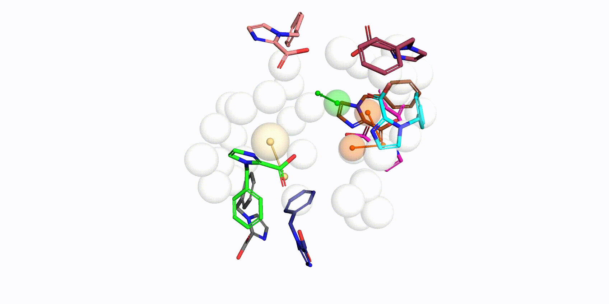

# Knowledge-Guided Diffusion Model for 3D Ligand-Pharmacophore Mapping

Official implementation of [Knowledge-Guided Diffusion Model for 3D Ligand-Pharmacophore Mapping](to be published) by JunLin Yu, Cong Zhou, XiangGen Liu, GuoBo Li. Source code, model weights, instructions and datasets for model training will be provided after the article is published.

Pharmacophores are abstractions of essential chemical interaction patterns, holding an irreplaceable position in drug discovery. Despite the availability of many pharmacophore-based tools, the adoption of deep learning for pharmacophore-guided drug discovery remains relatively rare. We herein propose a novel knowledge-guided diffusion framework for ‘on-the-fly’ 3D ligand-pharmacophore mapping, named DiffPhore. It comprises a knowledge-guided ligand-pharmacophore mapping encoder, a diffusion conformation generator, and a calibrated conformation sampler. By training on two newly established benchmark datasets of pharmacophore-ligand pairs, DiffPhore achieved state-of-the-art performance in predicting ligand active conformations, surpassing traditional pharmacophore tools and several advanced docking methods. It also manifested superior virtual screening power for both lead discovery and target fishing. 

If you have questions, don't hesitate to open an issue or send us an email at vicfisher6072@163.com, liuxianggen@scu.edu.cn and liguobo@scu.edu.cn.

